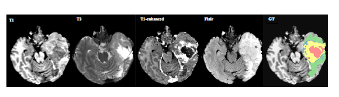
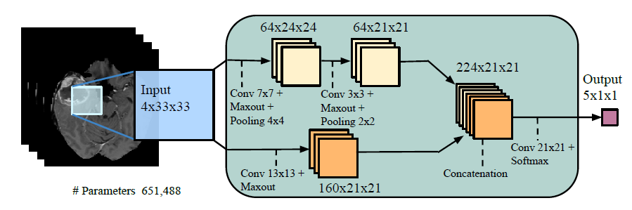
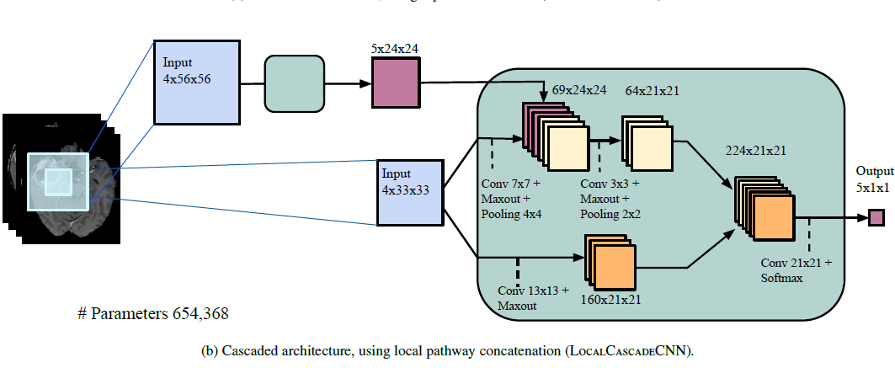

# Brain-Tumor-Segmentation-using-Deep-Neural-networks
Keras implementation of paper by the same name

#### Note : AS evident from many latest papers and my discussion with author of this paper, Newer approaches perform much better on semantic segmentation task. If you are looking for implementing yourselves, you would like to implement these approaches and consider this work for starting point for understanding.

I have uploaded the code in FinalCode.ipynb. For explanation of paper and the changes I have done, the information is in there with .pptx file and this readme also. For accessing the dataset, you need to create account with https://www.smir.ch/BRATS/Start2013. For free access to GPU, refer to this Google Colab tutorial https://medium.com/deep-learning-turkey/google-colab-free-gpu-tutorial-e113627b9f5d or my previous repo https://github.com/jadevaibhav/Signature-verification-using-deep-learning. I am removing data and model files and uploading the code only. All the images I used here are from the paper only.

## Using the code
You are free to use contents of this repo for academic and non-commercial purposes only.

## Resources
https://arxiv.org/pdf/1505.03540.pdf
(this is sound and complete paper, refer to this and it's references for all questions)

## Modifications
- ##### Instead of two-way training process as mentioned in paper, I have used weighted-categorical-loss function for which weights are calculated per slice basis.
- ##### I have used batchnormalization instead of dropout.
- ##### Batchnorm also smoothens the optimization curve(refer to https://arxiv.org/pdf/1805.11604.pdf).
- ##### As per the paper, the loss is defined as cumulative loss of categorization of all patches-per-pixel of the given slice. Instead, I am creating a dataset for such slice and training using mini-batch gradient descent(where it should batch gradient descent in accordance of the paper).

## Overview
Paper poses the pixel-wise segmentation problem as classification problem. The model takes a patch around the central pixel and labels from the five categories, as defined by the dataset -
- Necrosis
- Edema
- Non-enhancing tumor
- Enhancing tumor 
- Everything else
This way, the model goes over the entire image producing labels pixel-by-pixel.  

## BRATS Dataset 
I have used BRATS 2013 training dataset for the analysis of the proposed methodology. It consists of real patient images as well as synthetic images created by SMIR. Each of these folders are then subdivided into High Grade and Low Grade images. For each patient, four modalities(T1, T1-C, T2 and FLAIR) are provided. The fifth image has ground truth labels for each pixel. The dimensions of image is different in LG and HG. For HG, the dimensions are (176,261,160) and for LG are (176,196,216).



## Dataset pre-processing 
As per the requirement of the algorithm, slices with the four modalities as channels are created. For taking slices of 3D modality image, I have used 2nd dimension. At time of training/ testing, we need to generate patches centered on pixel which we would classifying. We are ignoring the border pixels of images and taking only inside pixels. Generating a dataset per slice. I am filtering out blank slices and patches. Also, slices with all non-tumor pixels are ignored.

## Model Architecture 
### TwoPathCNN
 It shows the 2 paths input patch has to go through. 1st path where 2 convolutional layers are used is the local path. The 1st convolutional layer is of size (7,7) and 2nd one is of size (3,3). Global path consist of (21,21) filter. As the local path has smaller kernel, it processes finer details because of small neighbourhood. Opposed to this, global path process in more global way. After the convolutional layer, Max-Out [Goodfellow et.al] is used. After which max-pooling is used with stride 1. I have changed the max-pooling to convolution with same dimensions. In the global path, after convolution max-out is carried out. THere is no max-pooling in the global path.After activation are generated from both paths, they are concatenated and final convolution is carried out. Then Softmax activation is applied to the output activations. Because there is no fully-connected layers in model, substantial decrease in number of parameters as well as speed-up in computation.   



### Cascading Architectures
Cascading architectures uses TwoPathCNN models joined at various positions. The paper defines 3 of them - 
- InputCascadeCNN: 1st’s output joined to 2nd’s input
- LocalCascadeCNN: 1st’s output joined to 2nd’s hidden layer(local path 2nd conv input)
- MFCcascadeCNN: 1st’s output joined to 2nd’s concatenation of two paths 



## Training
### Loss function
As per the paper,Loss function is defined as ‘Categorical cross-entropy’ summed over all pixels of a slice. I have modified the loss function in 2-ways:
- The dataset per slice is being directly fed for training with mini-batch gradient descent i.e., I am calculating and back-propagating loss for much smaller number of patches than whole slice.
- For each dataset, I am calculating weights per category, resulting into weighted-loss function. This is taken as measure to skewed dataset, as number of non-tumor pixels mostly constitutes dataset. 
   
### Regularization 
The paper uses drop-out for regularization. Instead, I have used Batch-normalization,which is used for regularization also. In this paper, authors have shown that batch-norm helps training because it smoothens the optimization plane. Which helps in stable gradients and faster reaching optima. When training without regularization and weighted-loss function, I found out that model gets stuck at local optima, such that it always predicts ‘non-tumor’ label. After adding these 2, I found out increase in performance of the model.
 
## Performance
As the dataset is very large because of patch-per-pixel-wise training scheme, I am not able to train the models on all of the dataset. For now, both cascading models have been trained on 4 HG images and tested on a sample slice from new brain image. As mentioned in paper, I have computed f-measure for complete tumor region.
##### Complete score: labels 1+2+3+4 for patients data.
```


Slice Number                 F1-Score (complete) 
(HG 0027)              InputCascadeCNN  MFCcascadeCNN
105                             0.9250  0.80091
106                             0.9271  0.8029
107                             0.9269  0.8085
108                             0.9280  0.8114
109                            0.92691  0.8056
110                             0.9277  0.7986
111                             0.9291  0.7929
112                             0.9297  0.7868
113                             0.9273  0.79228
```
## Last Few Words
This paper is really simple, elegant and brillant. It put together various architectural and training ideas to tackle the brain tumor segementation. I am really thankful to Dr. Aditya abhyankar, Dean, DoT, Pune University, who helped solve my doubts and encouraged me to try out this paper. Special thanks to Mohammad Havaei, author of the paper, who also guided me and solved my doubts. 

Now to all who were with me till end, Thank you for your efforts! If you liked my repo and the work I have done, feel free to star this repo and follow me. I will make sure to bring out awesome deep learning projects like this in the future. Until the next time, サヨナラ!
